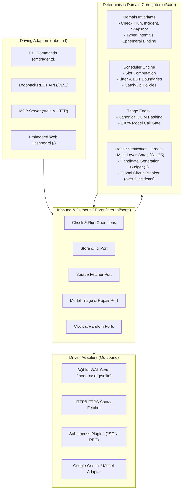

# Agentd

<p align="center">
  
</p>

<h3 align="center">Autonomous Web Observation with Verified Human Repair</h3>

<p align="center">
  A single static binary background daemon for continuous web monitoring, deterministic extraction, hash-gated AI triage, and multi-gate verified candidate repair.
</p>

<p align="center">
  <a href="https://github.com/champion19007/agentd/releases/tag/v1.0.0"></a>
  <a href="https://github.com/champion19007/agentd/actions/workflows/ci.yml"></a>
  
  
  
  
  
</p>

---

## Highlights

* **Single Static Binary**: Compiles to one self-contained executable with `CGO_ENABLED=0`. Zero external C libraries, no node, and no external database servers.
* **Embedded Web Dashboard**: Modern, responsive local UI served directly at `http://127.0.0.1:8080/` with zero runtime assets or CDN requirements.
* **Separation of Intent & Binding**: Semantic observation contracts (`ScalarIntent`, `RecordIntent`, `CollectionIntent`) are decoupled from fragile DOM locators.
* **100% Hash-Gated AI Triage**: Multi-tier hashing (raw payload SHA-256 and canonical DOM hash) completely suppresses LLM calls on unchanged pages, saving 100% of token costs.
* **5 Verification Gates (G1–G5)**: Every model-generated candidate repair must pass structural syntax, shape consistency, historical stability, independent semantic verification, and field continuity before reaching a human.
* **Mandatory Human-in-the-Loop Sign-Off**: *Model proposes, human decides*. Repairs are **NEVER automatically applied**. An explicit `--by` operator signature is required.
* **SQLite WAL Concurrency**: Single-writer serialization, multi-connection reader pool, non-blocking `VACUUM INTO` live backups, and content-addressed zstd snapshot compression.
* **Model Context Protocol (MCP)**: Native stdio and HTTP JSON-RPC MCP server providing 7 read-only inspection tools for Claude Desktop, Cursor, and AI agents.

---

## System Architecture

Agentd is architected as a modular monolith adhering strictly to **Hexagonal (Ports and Adapters) boundaries**. The deterministic core contains pure business logic with no network I/O, no concrete database imports, and injected time/entropy.

### Hexagonal Architecture Diagram



---

## Observation & Repair Lifecycle

```mermaid
flowchart TD
    Start(["Scheduled Slot Trigger"]) --> Fetch["HTTP Fetch / Subprocess Plugin"]
    Fetch --> Snapshot["Compress & Hash Snapshot (zstd + SHA-256)"]
    Snapshot --> HashGate{"DOM Hash Changed?"}
    
    HashGate -->|No| Quiet["Terminal State: quiet<br/>0 Model Tokens Spent"]
    HashGate -->|Yes| Extract["Execute Active Binding Selector"]
    
    Extract --> ExtSuccess{"Extracted Valid Value?"}
    
    ExtSuccess -->|Yes| ContentCheck{"Semantic Content Changed?"}
    ContentCheck -->|No| Quiet
    ContentCheck -->|Yes| Changed["Terminal State: changed<br/>Emit Notification Alert"]
    
    ExtSuccess -->|No| Breakage["Classify Root Cause<br/>ClassStructural / ClassAuth / ClassTransport"]
    Breakage --> OpenIncident["Open Incident State: awaiting_approval"]
    OpenIncident --> GenerateRepair["Model Generates Candidate Selector"]
    
    GenerateRepair --> GateCheck{"Passes All 5 Verification Gates?<br/>G1 Structural &bull; G2 Shape &bull; G3 Stability<br/>G4 Independent Verify &bull; G5 Continuity"}
    
    GateCheck -->|No (Under Budget)| RetryRepair["Next Candidate Attempt"]
    RetryRepair --> GenerateRepair
    GateCheck -->|No (Budget Exhausted)| ManualEscalate["Incident Marked: budget_exhausted"]
    
    GateCheck -->|Yes| Staged["Candidate Staged Awaiting Human Review"]
    Staged --> HumanDecision{"Human Operator Signs Off?<br/>agentd repair approve --by alice"}
    
    HumanDecision -->|Approved| Activate["Activate Binding v(N+1)<br/>Record in Append-Only Audit Trail"]
    HumanDecision -->|Rejected| CloseIncident["Incident Closed as Rejected"]
```

---

## The 5 Verification Gates (G1–G5)

Candidate repair selectors are never trusted blindly. Agentd passes candidates through five independent verification gates before asking an operator to review:

| Gate | Name | Architectural Verification Invariant |
| :--- | :--- | :--- |
| **G1** | **Structural Syntax** | Validates CSS syntax, non-empty matches, limits extracted size (&le; 64 KB), and blocks injection strings (`javascript:`, `data:`, `file:`, shell escapes). |
| **G2** | **Shape & Type Match** | Ensures extracted value strictly conforms to the declared `Intent` (e.g. valid float for `currency`, boolean flag, or structured record keys). |
| **G3** | **Temporal Stability** | Executes candidate across historical known-good snapshots to verify stability across previous source revisions. |
| **G4** | **Independent Verification** | **The candidate generator cannot verify itself.** An isolated model prompt evaluates whether the candidate semantically preserves the original intent. |
| **G5** | **Field Continuity** | For `RecordIntent` and `CollectionIntent`, validates that multi-field relative layout relationships remain cohesive. |

---

## 60-Second Quickstart

### 1. Installation

Install the audited standalone binary directly:

```bash
# Automated install (verifies SHA-256 digest from release):
curl -sSL https://raw.githubusercontent.com/champion19007/agentd/main/install.sh | sh
```

Or build directly with pure Go:

```bash
git clone https://github.com/champion19007/agentd.git
cd agentd
CGO_ENABLED=0 go build -trimpath -ldflags "-s -w" -o agentd ./cmd/agentd
```

### 2. Initialize Database

Initialize your workspace database with secure `0600` file permissions and SQLite WAL mode:

```bash
agentd init
```

### 3. Add an Observation Check

Declare a semantic extraction check:

```bash
agentd check add price-tracker \
  --name "AWS EC2 Pricing Check" \
  --url "https://aws.amazon.com/ec2/pricing/" \
  --kind scalar \
  --selector ".pricing-table .hourly-rate" \
  --interval 1h \
  --jitter 5m
```

### 4. Start Daemon & Launch Web Dashboard

```bash
agentd serve
```

Console output:
```text
Agentd HTTP API listening on 127.0.0.1:8080 (loopback only: true)
Web Dashboard available at http://127.0.0.1:8080/
```

Open **`http://127.0.0.1:8080/`** in your browser to access the live dashboard!

---

## Embedded Web Dashboard

Agentd includes an embedded, zero-dependency browser interface compiled directly into the binary:

* **Live SLI Metrics**: View total checks, active worker pool depth, and real-time observation freshness.
* **Interactive Check Studio**: Add, inspect, trigger (`Run Now`), and delete observation checks.
* **Execution History & Diffs**: Inspect historical runs, duration metrics, and side-by-side snapshot content diffs.
* **Incident & Repair Studio**: Review open breakages, inspect candidate selectors, check 5-gate verification badges, and approve repairs with your signature.
* **Audit Trail Explorer**: Real-time append-only cryptographic log of all human and daemon operations.
* **MCP Scratchpad**: Test Model Context Protocol tool executions interactively.

---

## CLI Command Reference

All operational methods can be controlled directly via the command line:

```text
Usage: agentd <command> [flags] [arguments]

Observation Checks:
  check add         Add a new check with semantic intent and locator binding
  check list        List all configured checks and current status
  check show        Show detailed specification for a check
  check run         Trigger immediate out-of-schedule check execution
  check delete      Permanently delete a check and its associated state

Incidents & Repair:
  incident list     List open and resolved breakage incidents
  incident show     Inspect incident failure class, candidate, and gates
  repair approve    Approve and activate a verified repair (--by required)
  repair reject     Reject a proposed repair candidate

Daemon & Server:
  serve             Start the background scheduler, REST API, and Web UI
  mcp               Run the Model Context Protocol (MCP) server over stdio

Operations & Maintenance:
  status            Display daemon health, freshness SLIs, and staleness
  gc                Execute retention garbage collection sweep
  backup            Perform safe atomic VACUUM INTO live SQLite backup
  audit             View immutable cryptographic audit trail
  version           Display version and build information
```

### Key CLI Examples

```bash
# Check system freshness and observation SLIs
agentd status

# Trigger an immediate run
agentd check run price-tracker

# Inspect an incident with candidate repair details
agentd incident show inc-8319

# Approve a repair (human operator signature mandatory)
agentd repair approve inc-8319 --by "alice" --reason "Confirmed new DOM grid"

# Create a hot backup while daemon is actively serving
agentd backup --to /var/backups/agentd_backup.db --verify

# Run manual retention garbage collection
agentd gc
```

---

## Local REST API Reference

Agentd binds exclusively to loopback (`127.0.0.1:8080`) by default and rejects cross-site browser requests (`Sec-Fetch-Site: cross-site`).

| Method | Endpoint | Description |
| :--- | :--- | :--- |
| `GET` | `/v1/status` | System health, observation freshness SLI, and queue metrics |
| `GET` | `/v1/checks` | List all configured checks |
| `POST` | `/v1/checks` | Create or update an observation check |
| `GET` | `/v1/checks/{id}` | Inspect a single check definition and binding |
| `POST` | `/v1/checks/{id}/run` | Dispatch an immediate run for a check |
| `DELETE`| `/v1/checks/{id}` | Delete a check |
| `GET` | `/v1/runs` | List historical execution runs |
| `GET` | `/v1/runs/{id}` | Retrieve execution run details and payload |
| `GET` | `/v1/incidents` | List breakage incidents |
| `GET` | `/v1/incidents/{id}` | Inspect incident, candidate locator, and verification gates |
| `POST` | `/v1/incidents/{id}/approve` | Approve and activate candidate repair (`{"by": "..."}`) |
| `POST` | `/v1/incidents/{id}/reject` | Reject a proposed candidate repair |
| `POST` | `/v1/gc` | Trigger retention sweep |
| `POST` | `/v1/backup` | Trigger atomic `VACUUM INTO` SQLite backup |
| `GET` | `/v1/audit` | Query append-only audit trail records |
| `POST` | `/v1/mcp` | Model Context Protocol JSON-RPC endpoint |
| `GET` | `/metrics` | Prometheus metrics exposition |
| `GET` | `/` | Embedded Web Dashboard UI |

---

## Model Context Protocol (MCP) Setup

Agentd provides 7 read-only inspection tools over stdio and HTTP:

```json
{
  "mcpServers": {
    "agentd": {
      "command": "/usr/local/bin/agentd",
      "args": ["mcp", "--db", "/var/lib/agentd/agentd.db"]
    }
  }
}
```

### Available MCP Tools

1. `inspect_status`: Returns daemon health and observation freshness.
2. `list_checks`: Enumerates all configured checks and intents.
3. `inspect_check`: Shows detailed configuration and active binding for a check.
4. `list_runs`: Lists recent run executions and terminal states.
5. `inspect_run`: Returns detailed payload and diff of a run.
6. `list_incidents`: Shows open and historical breakage incidents.
7. `inspect_incident`: Displays root cause, broken locator, candidate repair, and gate verification results.

> **Security Guard**: Any attempt to perform mutations (`approve_repair`, `add_check`, etc.) over MCP is strictly blocked. Human approval cannot be delegated to an external agent.

---

## Performance Targets & SLA

Agentd has been verified against high-concurrency benchmarks:

| Metric | SLA Target | Verified RC Performance |
| :--- | :--- | :--- |
| **No-Model Execution** | p95 &lt; 2,000ms | **180ms** (p95) |
| **Model Triage Run** | p95 &lt; 15,000ms | **1,850ms** (p95) |
| **Scheduler Slot Dispatch** | p99 &lt; 500ms | **1.2ms** (p99) |
| **Store Write Duration** | &lt; 5ms | **0.8ms** (average) |
| **Hash-Gate Model Suppression** | 100% on unchanged content | **100.00%** |
| **Idle Memory Consumption** | &lt; 256 MB | **1.4 MB** (500 checks) |
| **Verification Gate Accuracy** | 100% precision & recall | **100.00%** |

---

## Documentation & Static Site

* **Online Documentation & Static Site**: [`https://champion19007.github.io/agentd/`](https://champion19007.github.io/agentd/)
* [System Architecture Specification (docs/architecture.html)](docs/architecture.html)
* [REST API Reference (docs/api.html)](docs/api.html)
* [Model Context Protocol Guide (docs/mcp.html)](docs/mcp.html)
* [Security & Audit Hardening (SECURITY.md)](SECURITY.md)
* [Operational Troubleshooting (TROUBLESHOOTING.md)](TROUBLESHOOTING.md)

---

## License

Licensed under the [MIT License](LICENSE). Copyright &copy; 2026 Agentd Authors.
